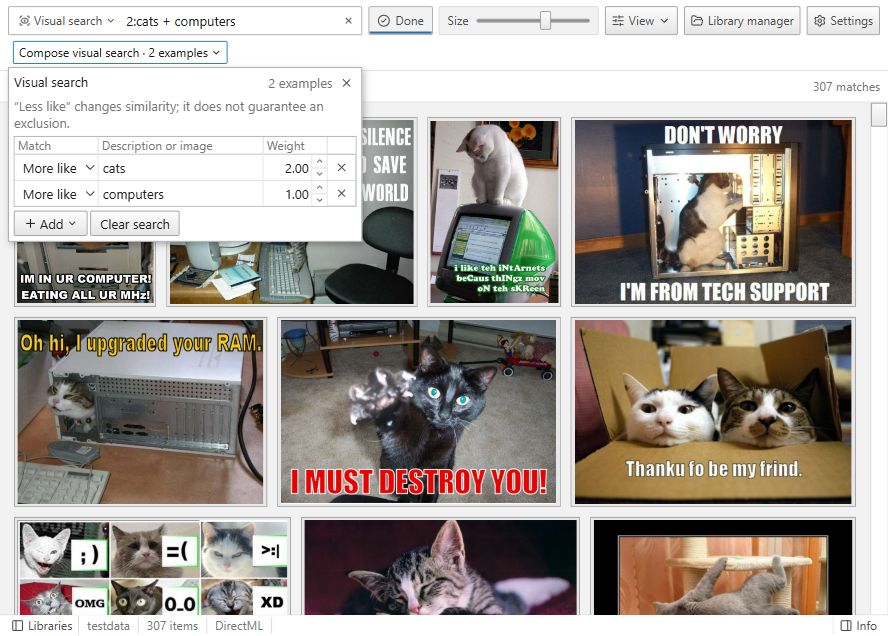
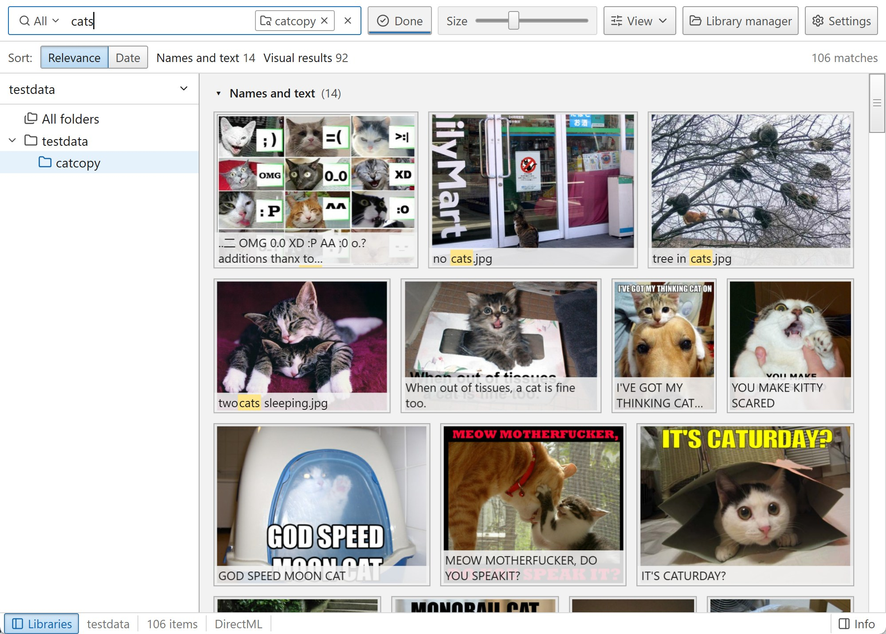
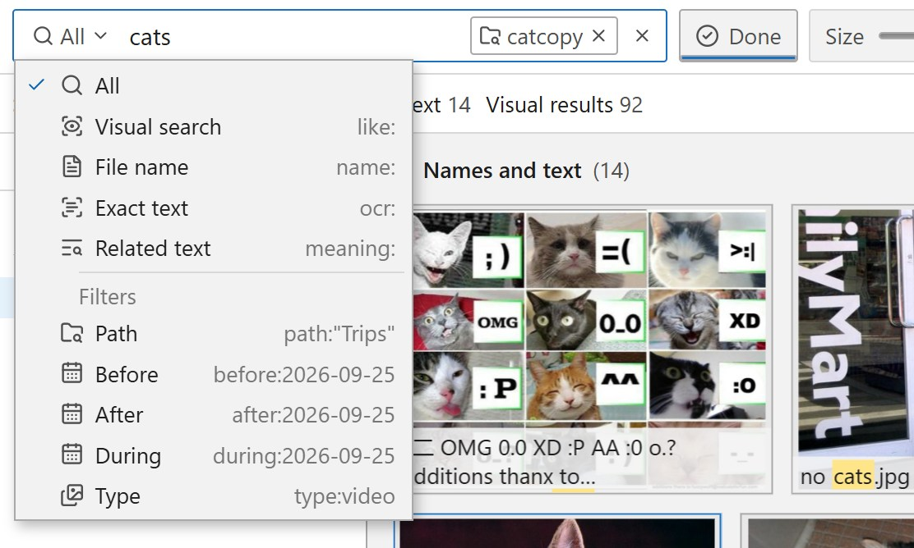
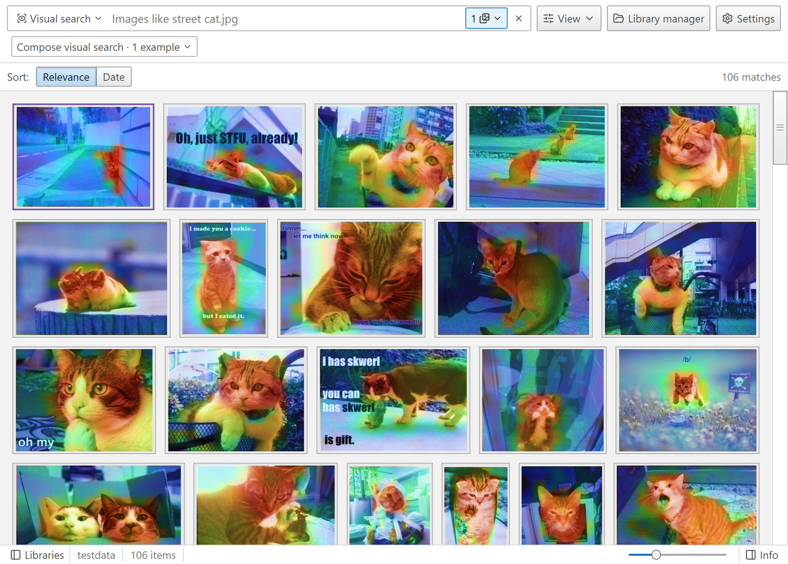
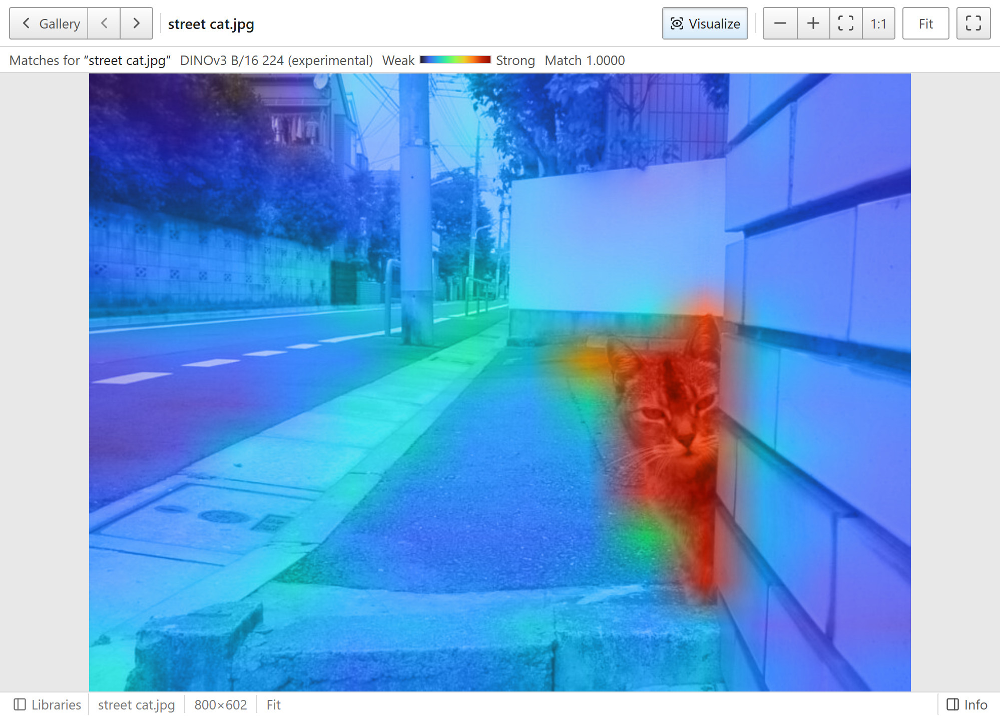

# Nicegal

[**Download the latest release**](https://github.com/centuryofimage/nicegal/releases/latest)

nicegal is a super fast desktop gallery for photos and videos. it has powerful search features, and is designed to help people find stuff in gigantic unsorted downloads folders.

it supports visually searching photos and videos with CLIP. you can also search with an image. search indexing uses your gpu if you have one, through DirectML and WebGPU.

you can browse existing folders without moving your files. there are 3 phone style gallery layouts with date navigation, video playback, and a filter for photos or videos.

visual search works with descriptions, example images, or both together. you can use more than one image in a search.

you can also search by file name, or enable OCR (PaddleOCR) to search the text inside images.

### See what matched

some models can show which parts of an image match your search. these screenshots use DINOv3, with match areas shown in the gallery and with Visualize on an opened image.

  
  

## Get Nicegal

[Downloads](https://github.com/centuryofimage/nicegal/releases)

search models download on first use. photos and videos are processed locally, all data remains on your computer, no telemetry.

built with svelte and a
[rust search backend](https://github.com/centuryofimage/nicegal-server), using DirectML and OpenVino thru [ort](https://ort.pyke.io/).

## Perf tips

The app is super super fast when using CLIP models. I hit 200 images per second on my NVIDIA 5070.

OCR is slow and intensive no matter what. 30 images per second on my computer... but CLIP works really well as an OCR model, so you can just not use OCR.

If you have a really bad gpu, you might benefit from changing the onnx execution provider from directml to OpenVino and then restarting the application. For most users, DirectML > OpenVino > CPU.

## Special acknowledgements

This project was heavily inspired by [rclip](https://github.com/yurijmikhalevich/rclip). It definitely wouldn't have been possible without [ort](https://ort.pyke.io/) and [sqlite-vec](https://github.com/asg017/sqlite-vec).

## License

### Application licenses

The original frontend code is licensed under [MIT](LICENSE). The original backend
code is licensed under [GNU AGPL version 3 only](nicegal-server/LICENSE).
Modified third-party code in `nicegal-server/vendor/` remains Apache-2.0.
These terms do not replace separately identified component licenses. Downloaded
model weights are subject to their publishers' licenses. See [LICENSING](LICENSING).
